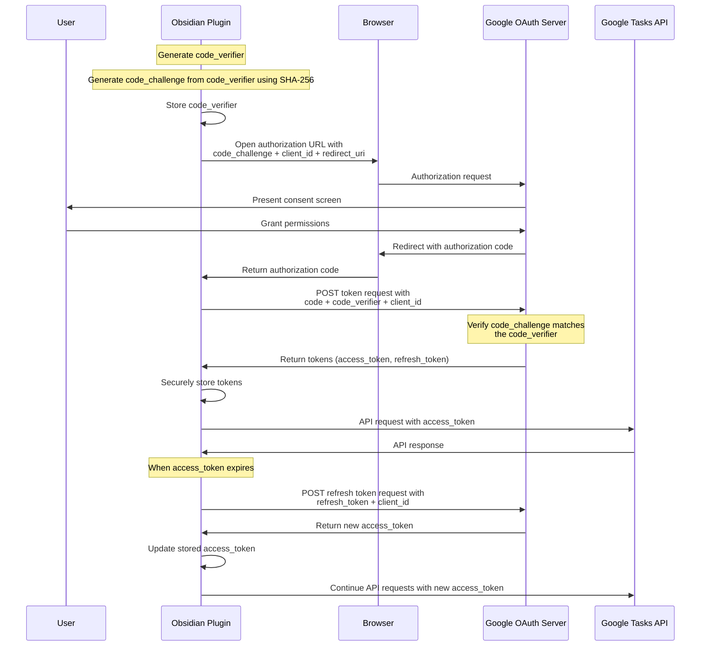

# PKCE Authentication Flow Diagram

Below is a visualization of the OAuth 2.0 PKCE authentication flow as implemented in the Obsidian Reminder plugin.

## Key Security Benefits of PKCE

1. **Protection against Authorization Code Interception**:

   - Even if an attacker intercepts the authorization code, they cannot exchange it for tokens without the code_verifier
   - Only the legitimate app has the original code_verifier

2. **Public Client Security**:

   - Eliminates the need for client secrets in native apps
   - Provides a secure authentication mechanism for clients that cannot protect secrets

3. **Protection against CSRF and Authorization Code Injection**:
   - The code_challenge/code_verifier pair acts as a strong state binding mechanism
   - Prevents attackers from injecting their own authorization codes
